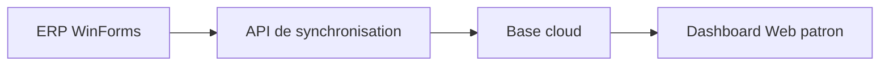

# Séparation Architecture

Le système doit rester séparé en trois applications indépendantes.

## 1. ERP Commercial WinForms

- Technologie: VB.NET WinForms
- Base locale: `CommercialMagDB`
- Rôle:
  - produits
  - stock
  - entrées
  - sorties
  - inventaire
  - dépenses
  - dettes
  - caisse
  - utilisateurs

## 2. API de synchronisation

- Technologie: ASP.NET Core Web API
- Base cloud: `CommercialMagCloudDB`
- Rôle:
  - recevoir les données de l'ERP
  - synchroniser ventes, sorties et dépenses
  - exposer les données de consultation

## 3. Dashboard Web Patron

- Technologie cible: Blazor Web App ou ASP.NET Core MVC
- Rôle:
  - consultation uniquement
  - aucune saisie métier
  - aucune modification de données

## Flux imposé

## Règles de séparation

- Le dashboard web ne doit pas être compilé dans le projet WinForms.
- Le dashboard web ne doit pas accéder directement à la base locale.
- Le dashboard web consomme uniquement l'API.
- Le projet WinForms reste autonome pour l'exploitation locale.
- Le projet API reste autonome pour la synchronisation et la consultation cloud.

## Conséquence dans le dépôt

- Les formulaires et clients web du dashboard patron restent hors du `.vbproj` WinForms.
- Les écrans WinForms gardent uniquement les interfaces métier locales.
- Le dashboard web sera maintenu dans un projet séparé.
