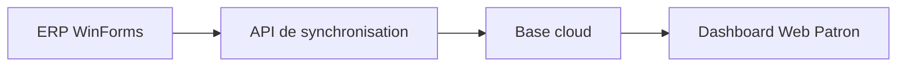

# Déploiement local des 3 projets

Ce guide décrit le lancement séparé des 3 applications du système.

## 1. ERP Commercial WinForms

Projet:

- `prototype/WinFormsVB/DevCommerc8ak`

Lancement:

- ouvrir `prototype/WinFormsVB/DevCommerc8ak/DevCommerc8ak.vbproj` dans Visual Studio
- définir ce projet comme projet de démarrage
- vérifier la connexion SQL locale dans `App.config`
- lancer en mode `Debug`

Rôle:

- gestion stock
- caisse
- dépenses
- inventaire
- utilisateurs
- dettes
- approvisionnement

## 2. API de synchronisation

Projet:

- `prototype/ApiCommercialMagDB`

Solution dédiée:

- `prototype/ApiCommercialMagDB/CommercialMagDb.Api.sln`

Lancement:

- ouvrir la solution dédiée dans Visual Studio
- ou exécuter:

```bash
dotnet run --project prototype/ApiCommercialMagDB/CommercialMagDb.Api.csproj
```

Configuration:

- `appsettings.json`
- `appsettings.Development.json`

Rôle:

- authentification JWT
- synchronisation des sorties
- synchronisation des dépenses
- alimentation du dashboard patron

## 3. Dashboard Web Patron

Projet:

- `prototype/DashboardWebPatron`

Solution dédiée:

- `prototype/DashboardWebPatron/DashboardWebPatron.sln`

Lancement:

- ouvrir la solution dédiée dans Visual Studio
- ou exécuter:

```bash
dotnet run --project prototype/DashboardWebPatron/DashboardWebPatron.csproj
```

Rôle:

- consultation seule
- synthèse jour / semaine / mois / année
- mode TV
- mode mobile

## Ordre de démarrage conseillé

1. démarrer l'API de synchronisation
2. démarrer le Dashboard Web Patron
3. démarrer l'ERP WinForms

## Flux de données



## Important

- le Dashboard Web Patron ne doit jamais accéder directement à la base locale de l'ERP
- le dashboard web consomme uniquement l'API
- l'ERP WinForms reste indépendant et continue à fonctionner en local

